## Background
The Washington State Public Health Lab (**WAPHL**) serves as the Antimicrobial Resistance Laboratory Nextwork site for the Western Region
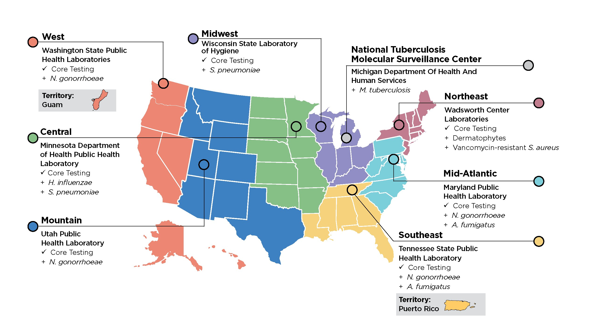
[image source](https://www.cdc.gov/antimicrobial-resistance-laboratory-networks/media/images/AR-Lab-Network-Regional-Labs-Map.jpg)


## ARLN Sequencing at WA PHL
```{python}
import pandas as pd
import plotly.graph_objects as go

FUNGAL_GENERA = {"Candidozyma"}
GROUP_COLOR = {"Bacteria": (12, 84, 96),    # NW teal
               "Fungi":    (228, 132, 48)}  # NW orange

def tint(rgb, f, alpha=1.0):
    """Lighten an RGB triple toward white by fraction f."""
    r, g, b = (int(c + (255 - c) * f) for c in rgb)
    return f"rgba({r},{g},{b},{alpha})"

df = pd.read_csv("data/hai_data.csv")
df = df.rename(columns={df.columns[0]: "year", df.columns[1]: "species"})
if "genus" not in df.columns:
    df["genus"] = df["species"].astype(str).str.split(n=1).str[0]

df["group"] = df["genus"].apply(lambda g: "Fungi" if g in FUNGAL_GENERA else "Bacteria")

# zero-filled cumulative counts at both levels
genus_cum = df.groupby(["year", "genus"]).size().unstack(fill_value=0).sort_index().cumsum()
group_cum = df.groupby(["year", "group"]).size().unstack(fill_value=0).sort_index().cumsum()

years = genus_cum.index.tolist()
members = {grp: sorted(sub["genus"].unique()) for grp, sub in df.groupby("group")}

fig = go.Figure()

# muted genus lines first, so the totals draw on top of them
for grp, gens in members.items():
    base = GROUP_COLOR[grp]
    for i, g in enumerate(gens):
        shade = 0.35 + 0.45 * (i / max(len(gens) - 1, 1))   # 35%-80% toward white
        col = tint(base, shade, 0.85)
        fig.add_trace(go.Scatter(
            x=years, y=genus_cum[g], name=g,
            legendgroup=grp, legendgrouptitle=dict(text=grp),
            mode="lines+markers",
            line=dict(color=col, width=1.2),
            marker=dict(size=4, color=col),
            hovertemplate=f"{g}<br>Year: %{{x}}<br>Cumulative: %{{y}}<extra></extra>"))

# dominant group totals
for grp in members:
    col = tint(GROUP_COLOR[grp], 0)
    fig.add_trace(go.Scatter(
        x=years, y=group_cum[grp], name=f"<b>{grp} (total)</b>",
        legendgroup=grp, legendgrouptitle=dict(text=grp),
        mode="lines+markers",
        line=dict(color=col, width=3.5),
        marker=dict(size=8, color=col, line=dict(width=1.2, color="white")),
        hovertemplate=f"<b>{grp} total</b><br>Year: %{{x}}<br>Cumulative: %{{y}}<extra></extra>"))

fig.update_layout(
    title=dict(text="Cumulative isolates — bacterial & fungal", x=0.02),
    xaxis=dict(title="Year", dtick=1, showgrid=False),
    yaxis=dict(title="Cumulative count", gridcolor="#eee", rangemode="tozero"),
    legend=dict(groupclick="toggleitem"),
    hovermode="closest",
    plot_bgcolor="white", paper_bgcolor="white")

fig.write_html("data/cumulative_by_group.html", include_plotlyjs="cdn")
fig
```

## Overview

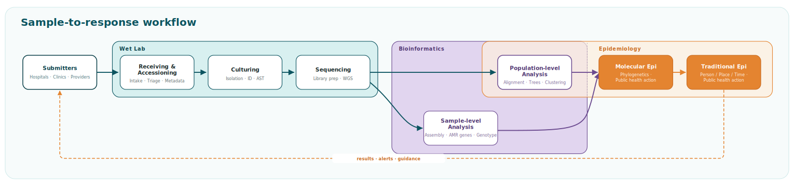

- Bacterial and fungal genomic analysis follow a similar workflow
- Bioinformatics and genomic epidemiology sometimes overlap - driven by policy and funding differences

## Sample to Whole Genome Sequences

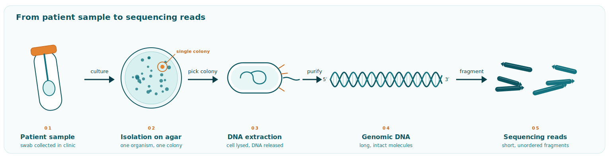

- Genomes are broken into small pieces before sequencing
- Bioinformaticians put these pieces back together

## Sample-level Analysis

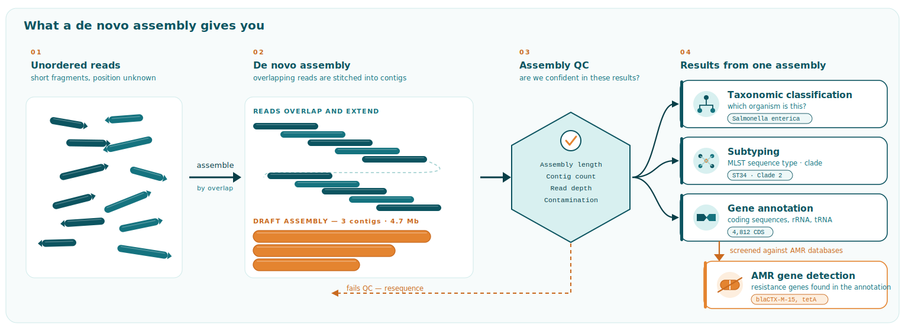

### Analyses performed on each sample individually - **often performed once!**

- **De novo assembly** is a common starting point
- Multiple results from a single analysis - taxonomy, subtype, genes of interest

## Population-level Analysis

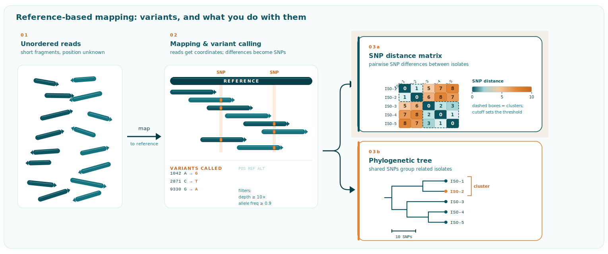

### Analyses performed on a population of samples - **often performed many times!**

- Populations defined based on genetic relatedness (e.g., sequence type, MinHash cluster)
- **Reference-based assembly** is a common starting point (e.g., core SNP analysis)
- Multiple results generated from a single analysis - SNP distances, phylogenetic tree, etc.,

## Quality Assurance

### Must ensure results are high quality — **reproducible** and **accurate**.

<br>

### How we measure quality depends on the metric being reported:

| Metric | De novo analysis | Phylogenetic analysis |
|:-------|:-----------------|:----------------------|
| **Read depth** | ≥ 40× average across the genome | ≥ 10× at every genome site |
| **Genome coverage** | Assembly size within the expected range for the species | ≥ 90% of the reference covered at ≥ 10× |
| **Contamination signal** | Inflated assembly size; species not resolved | Reads supporting multiple alleles at a site |

## Interpretation & Reporting

:::: {.columns}
::: {.column width=49%}
Genomic data is large, complex, and produces **many** results!

#### Data Formats:

- Tabular (CSV, TSV, Excel, etc.)
- Trees (Newick)
- Genome assembly (FASTA)

Communicating these results can be challenging!
:::

::: {.column width=49%}
**Example Phylogenetic Tree**

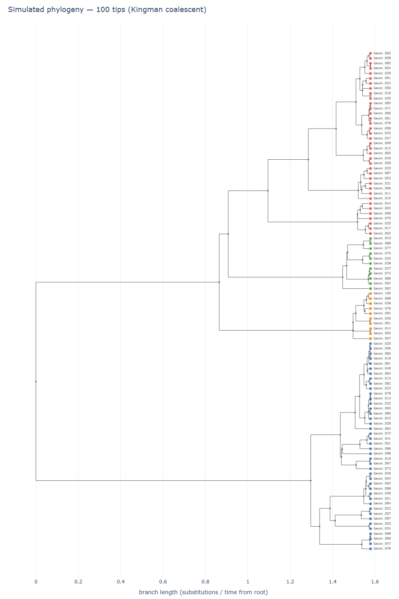

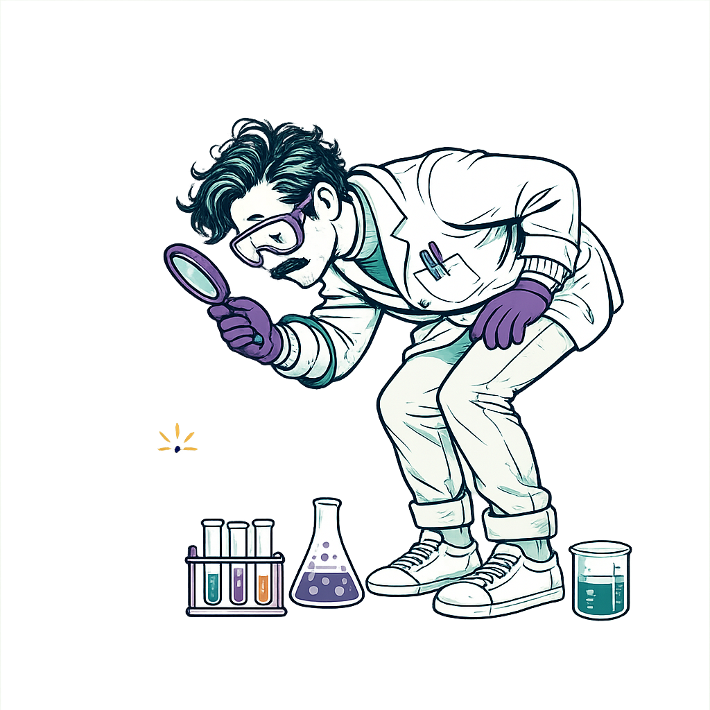{.absolute top="60%" left="80%" width="250" style="z-index: 10;"}

:::
::::


## Interactive Datasets

<iframe src="data/phylo_tree/phylo_tree_100tips.html"
        width="100%"
        height="600"
        style="border:none;"
        title="Interactive phylogenetic tree">
</iframe>

## Microreact Reports

<iframe src="https://microreact.org/project/zika-virus?tt=rc"
        width="100%"
        height="600"
        style="border:none;"
        title="Microreact Example">
</iframe>

## Quality Management System

::: {.box .note}
Every public health lab follows a quality management system (**QMS**).
:::

::: {.box .accent .indent .fragment}
→ Every **QMS** is *different*.
:::

::: {.box .note .fragment}
The Washington PHL **QMS** follows **CLIA** standards — the Clinical Laboratory Improvement Amendments.
:::

::: {.box .accent .indent .fragment}
→ Results must be **validated** and **approved** by the Lab Director
:::

::: {.box .note .fragment}
**CLIA** standards apply to results intended for **patient care**.
:::

::: {.box .accent .indent .fragment}
→ Outbreak monitoring and AMR screening are **surveillance** — [not]{.underline} patient care.
:::

## Data Sharing

::: {.box .note}
Only **validated** results can be shared outside the PHL
:::

::: {.box .accent .indent .fragment}
→ *Unless* there is a data sharing agreement (**DSA**)
:::

::: {.box .note .fragment}
WA PHL has a **DSA** with WA DOH Molecular Epidemiologists
:::

::: {.box .accent .indent .fragment}
→ **Any** result can be shared, if at least [one]{.underline} result is validated
:::

<br>

:::{.fragment}
::: {.box .key .filled }
...but how we measure quality depends on the result being reported!
:::

{.absolute top="47%" left="85%" width="300" style="z-index: 10;"}
:::

## (Bacterial | Fungal) Analysis - Overview
- Include flowchart emphasizing sample-level and population-level analyses, who performs these analyses (bioinfo or mol epi), and connection to policy / funding reason why.
- Discuss the number of samples per week / month and the time spent (or anticipated time spent for CorgiSNPs)
- Briefly discuss the workflows and where they are performed (AWS + Seqera) - keep very high level but include links to GitHub

## (Bacterial | Fungal) Analysis - Sharing Results
- Show examples of results (de-identified or contrived)

## Bacterial Sequencing Overview
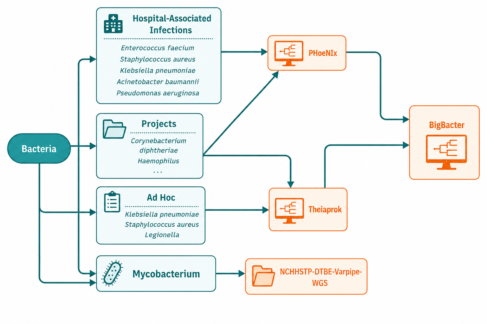


## Phoenix vs TheiaProk
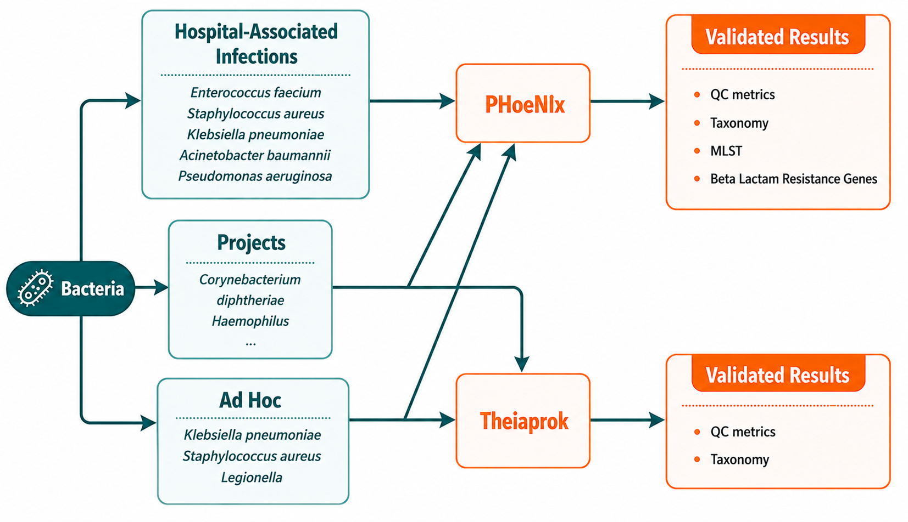


## Bacterial Dataflow
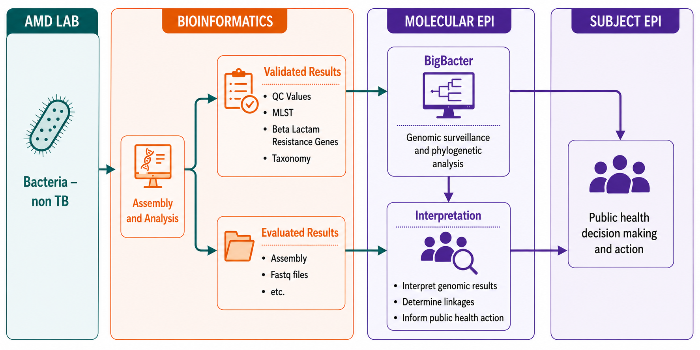


## Pipeline Output: HAI Bacteria

### PHoeNix

<div class="slide-metrics-table" style="overflow-x: auto; width: 100%;">
  <table style="width: 100%; border-collapse: collapse; white-space: nowrap;">
    <thead>
      <tr>
        <th>ID</th>
        <th>Auto_QC_Status</th>
        <th>Species</th>
        <th>MLST_Scheme_1</th>
        <th>MLST_1</th>
        <th>MLST_Scheme_2</th>
        <th>MLST_2</th>
        <th>GAMMA_Beta_Lactamase</th>
        <th>Auto_QC_Result</th>
      </tr>
    </thead>
    <tbody>
      <tr>
        <td>VeryRealSample_01</td>
        <td>PASS</td>
        <td>Pseudomonas aeruginosa</td>
        <td>paeruginosa</td>
        <td>ST654</td>
        <td>-</td>
        <td>-</td>
        <td>blaNDM-1_NG_049326</td>
        <td>PASS</td>
      </tr>
      <tr>
        <td>VeryRealSample_02</td>
        <td>PASS</td>
        <td>Acinetobacter baumannii</td>
        <td>abaumannii</td>
        <td>ST955</td>
        <td>abaumannii</td>
        <td>ST126</td>
        <td>Mbl_NC_010410,Zn-dep_hydrolase</td>
        <td>PASS</td>
      </tr>
      <tr>
        <td>VeryRealSample_03</td>
        <td>PASS</td>
        <td>Klebsiella pneumoniae</td>
        <td>klebsiella</td>
        <td>ST147</td>
        <td>-</td>
        <td>-</td>
        <td>ampH_CP003785,blaCTX-M-15</td>
        <td>PASS</td>
      </tr>
      <tr>
        <td>VeryRealSample_04</td>
        <td>PASS</td>
        <td>Escherichia coli</td>
        <td>ecoli(Achtman)</td>
        <td>ST410</td>
        <td>ecoli_2(Pasteur)</td>
        <td>ST471</td>
        <td>AmpC1_Ecoli_FN649414,blaCTX-M-15</td>
        <td>PASS</td>
      </tr>
      <tr>
        <td>VeryRealSample_05</td>
        <td>PASS</td>
        <td>Acinetobacter baumannii</td>
        <td>abaumannii</td>
        <td>ST2535-PA</td>
        <td>abaumannii</td>
        <td>ST2</td>
        <td>Mbl_NC_010410,Zn-dep_hydrolase</td>
        <td>PASS</td>
      </tr>
    </tbody>
  </table>
</div>

</br>

### BigBacter

<div class="slide-metrics-table" style="overflow-x: auto; width: 100%;">
  <table style="width: 100%; border-collapse: collapse; white-space: nowrap;">
    <thead>
      <tr>
        <th>id</th>
        <th>run</th>
        <th>status</th>
        <th>included</th>
        <th>taxa</th>
        <th>cluster</th>
        <th>partition</th>
        <th>strong_links</th>
        <th>inter_links</th>
        <th>genome_fr</th>
        <th>core_fract</th>
        <th>length</th>
        <th>masked</th>
        <th>missing</th>
        <th>mixed</th>
        <th>variants</th>
        <th>recomb_m</th>
        <th>max_snp_c</th>
        <th>mean_snp</th>
        <th>min_snp_d</th>
      </tr>
    </thead>
    <tbody>
      <tr>
        <td>RealSample</td>
        <td>1.78E+09</td>
        <td>new</td>
        <td>TRUE</td>
        <td>Shigella_sc</td>
        <td>1</td>
        <td>34</td>
        <td>RealSample03:RealSample</td>
        <td>WA100150</td>
        <td>0.994833</td>
        <td>0.994833</td>
        <td>5057083</td>
        <td>0</td>
        <td>26130</td>
        <td>0</td>
        <td>8</td>
        <td>FALSE</td>
        <td>580</td>
        <td>232</td>
        <td>0</td>
      </tr>
      <tr>
        <td>RealSample</td>
        <td>1.78E+09</td>
        <td>new</td>
        <td>TRUE</td>
        <td>Shigella_sc</td>
        <td>1</td>
        <td>40</td>
        <td>RealSample05</td>
        <td>WA100150</td>
        <td>0.964828</td>
        <td>0.961383</td>
        <td>5057083</td>
        <td>0</td>
        <td>177861</td>
        <td>0</td>
        <td>12</td>
        <td>FALSE</td>
        <td>586</td>
        <td>236</td>
        <td>1</td>
      </tr>
      <tr>
        <td>RealSample</td>
        <td>1.78E+09</td>
        <td>new</td>
        <td>TRUE</td>
        <td>Shigella_sc</td>
        <td>1</td>
        <td>34</td>
        <td>RealSample01:RealSample</td>
        <td>WA100150</td>
        <td>0.964795</td>
        <td>0.961146</td>
        <td>5057083</td>
        <td>0</td>
        <td>178027</td>
        <td>0</td>
        <td>8</td>
        <td>FALSE</td>
        <td>584</td>
        <td>234</td>
        <td>0</td>
      </tr>
      <tr>
        <td>RealSample</td>
        <td>1.78E+09</td>
        <td>new</td>
        <td>TRUE</td>
        <td>Shigella_sc</td>
        <td>1</td>
        <td>34</td>
        <td>RealSample01:RealSample</td>
        <td>WA100150</td>
        <td>0.964756</td>
        <td>0.960951</td>
        <td>5057083</td>
        <td>0</td>
        <td>178224</td>
        <td>0</td>
        <td>8</td>
        <td>FALSE</td>
        <td>584</td>
        <td>234</td>
        <td>0</td>
      </tr>
    </tbody>
  </table>
</div>


## Pipeline Output: HAI Bacteria
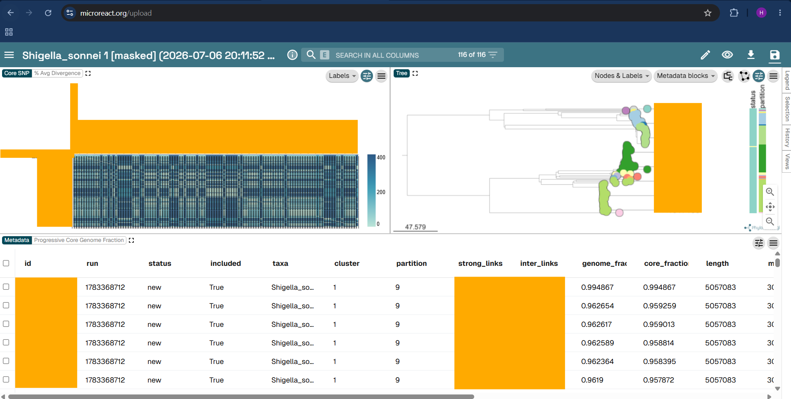


## Bacterial Logistics

<table style="width: 100%;">
  <thead>
    <tr>
      <th></th>
      <th>HAI Bacteria</th>
      <th>Non-HAI Bacteria</th>
    </tr>
  </thead>
  <tbody>
    <tr>
      <td><strong>Pipeline</strong></td>
      <td colspan="2" style="text-align: center;">PHoeNIx*</td>
    </tr>
    <tr>
      <td><strong>Frequency</strong></td>
      <td>~35-45 seqs/ 2x month</td>
      <td>~1-8 seqs/ week</td>
    </tr>
    <tr>
      <td><strong>Typical TAT</strong></td>
      <td colspan="2" style="text-align: center;">1-2 business days***</td>
    </tr>
    <tr>
      <td><strong>Compute Resources</strong></td>
      <td colspan="2" style="text-align: center;">AWS + Seqera</td>
    </tr>
  </tbody>
</table>

<br>
<table style="width: 100%;">
  <thead>
    <tr>
      <th></th>
      <th>HAI Bacteria</th>
      <th>Non-HAI Bacteria</th>
    </tr>
  </thead>
  <tbody>
    <tr>
      <td><strong>Pipeline</strong></td>
      <td colspan="2" style="text-align: center;">BigBacter**</td>
    </tr>
    <tr>
      <td><strong>Frequency</strong></td>
      <td>~3-19 seqs/ 2x month</td>
      <td>~1-8 seqs/ week</td>
    </tr>
    <tr>
      <td><strong>Typical TAT</strong></td>
      <td colspan="2" style="text-align: center;">1-2 business days***</td>
    </tr>
    <tr>
      <td><strong>Compute Resources</strong></td>
      <td colspan="2" style="text-align: center;">AWS + Seqera</td>
    </tr>
  </tbody>
</table>

- [*PHoeNIx](https://github.com/CDCgov/phoenix)
- [**BigBacter](https://github.com/NW-PaGe/bigbacter)
- ***Prioritized based on epi needs

## Fungal Dataflow
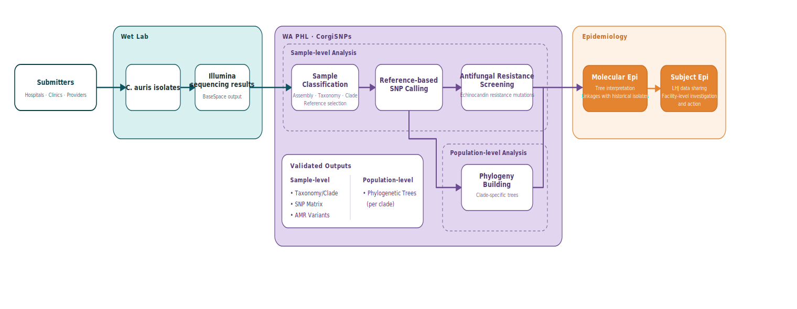

- WA PHL's only routine fungal bioinformatics workflow is for _Candida auris_ WGS, for the AR Lab Network
- WA PHL Bioinformatics can provide analyses for other fungi on an ad-hoc basis

## Fungal Logistics

<table style="width: 60%;">
  <thead>
    <tr>
      <th></th>
      <th><span style="font-style: italic;">Candida auris</span></th>
    </tr>
  </thead>
  <tbody>
    <tr>
      <td><strong>Pipeline</strong></td>
      <td>CorgiSNPs*</td>
    </tr>
    <tr>
      <td><strong>Frequency</strong></td>
      <td>~20-30 seqs/ 2x month</td>
    </tr>
    <tr>
      <td><strong>Typical TAT</strong></td>
      <td>1-2 business days</td>
    </tr>
    <tr>
      <td><strong>Compute Resources</strong></td>
      <td>AWS + Seqera</td>
    </tr>
  </tbody>
</table>
- *[CorgiSNPs](https://github.com/NW-PaGe/CorgiSNPs) currently undergoing validation. [MycoSNP](https://github.com/CDCgov/mycosnp-nf) is used for production runs currently.

## Pipeline Output: _Candida auris_

## Summary
- Jared will complete after all content is available
